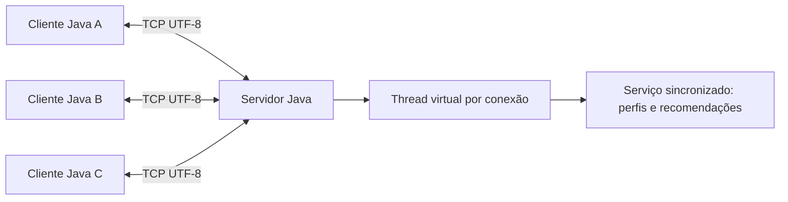

# Recomendação musical distribuída

Aplicação didática Java 21 com interface web, cliente de terminal e servidor TCP concorrente. O servidor inicia com 10 usuários e 15 artistas; cada perfil contém 15 notas de 0 a 4. Não há dependências externas em tempo de execução.

## Compilar e executar

Requisitos: JDK 21 e Maven. Na primeira compilação, o Maven pode precisar de internet para baixar plugins e a dependência de testes.

```bash
mvn clean package
java -jar target/recomendacao-musical-1.0-SNAPSHOT.jar servidor 5000
```

Abra **http://localhost:8080** no navegador. Escolha um perfil, altere uma nota e clique em **Salvar** para atualizar as recomendações. Você também pode cadastrar um usuário pela página.

Para mudar as portas, use `servidor 5001 8081` (TCP e web, respectivamente). Para acessar de outra máquina, use `http://IP_DO_SERVIDOR:8080` e libere também a porta HTTP na rede.

Em outros terminais, abra dois ou mais clientes:

```bash
java -jar target/recomendacao-musical-1.0-SNAPSHOT.jar cliente localhost 5000
```

Em outra máquina, substitua `localhost` pelo IP da máquina do servidor. As máquinas precisam ter conectividade e a porta TCP escolhida deve estar liberada. O servidor escuta nas interfaces locais; encerre com Ctrl+C. O comando `SAIR` encerra apenas o cliente.

## Comandos

| Comando | Efeito |
| --- | --- |
| `ARTISTAS` | Lista códigos de 1 a 15 e nomes |
| `USUARIOS` | Lista os usuários |
| `CADASTRAR Lucas` | Cria perfil com 15 zeros |
| `PERFIL Ana` | Exibe o vetor na ordem dos códigos |
| `AVALIAR Lucas 1 4` | Atribui nota 4 ao artista 1 |
| `RECOMENDAR Ana` | Exibe vizinhos, distâncias e recomendações |
| `SAIR` | Encerra a conexão |

Nomes diferenciam maiúsculas de minúsculas e aceitam de 1 a 30 letras, números, `_` e `-`, sem espaços. Comandos não diferenciam maiúsculas de minúsculas. Notas: **0** não conheço/não avaliei; **1** não gosto; **2** gosto muito pouco; **3** gosto; **4** gosto muito. Avaliar com zero remove a avaliação conhecida.

## Distância e recomendação

A distância euclidiana é `sqrt(sum((A[i] - B[i])²))`, considerando **somente índices com notas diferentes de zero nos dois perfis**. Zero não é uma rejeição. Sem avaliações em comum, a distância é representada internamente por infinito e o par é excluído dos vizinhos.

O enunciado perdeu a raiz em algumas fórmulas: a implementação utiliza a definição euclidiana com raiz. No exemplo `[4,3,0,4,2]` e `[3,2,4,4,0]`, a soma dos quadrados é 2 e a distância é **√2 ≈ 1,414**. No primeiro exemplo do enunciado, usando todas as posições, a distância seria 2; aplicando a regra de ignorar zero, ela é √3.

1. Compara o usuário com todos os demais, excluindo ele próprio e pares sem notas em comum.
2. Seleciona até três vizinhos por menor distância. Empates favorecem mais avaliações em comum e depois a ordem alfabética do nome.
3. Considera apenas artistas ainda não avaliados pelo usuário alvo.
4. Calcula a nota estimada pela média ponderada das avaliações não nulas desses vizinhos, usando peso `1 / (1 + distância)`. Notas baixas também participam da média.
5. Recomenda candidatos com nota estimada maior ou igual a 3, em ordem decrescente de nota, com desempate por código do artista.

Um perfil todo zero não recebe recomendações até avaliar artistas. Um perfil completo não tem novos artistas a recomendar. A distância não é normalizada: poucos itens em comum podem produzir uma proximidade pouco confiável. O número de itens comparados é exibido para tornar essa limitação visível.

## Arquitetura e concorrência



`App` seleciona o modo. `MusicClient` lê comandos, envia pedidos e apresenta respostas. `MusicServer` aceita conexões por `ServerSocket` e atende cada sessão com uma thread virtual. `MusicService` mantém os dados e calcula os vizinhos e as recomendações. `MusicWebServer` serve a interface HTML via HTTP na porta 8080 com o servidor HTTP do próprio JDK. Formulários POST alteram os dados e redirecionam para o perfil atualizado; GET apenas consulta. HTTP e TCP compartilham a mesma instância do serviço.

O protocolo é textual UTF-8: um comando por linha, uma resposta com uma ou mais linhas e uma linha final `FIM`. Erros de comando ou argumentos começam com `ERRO`, sem encerrar a sessão. O delimitador é necessário porque TCP transporta um fluxo de bytes, sem preservar fronteiras de mensagens. O cliente tem timeout de conexão de 5 segundos e de resposta de 15 segundos.

O monitor (`synchronized`) protege leituras e alterações; os vetores retornados são cópias. Os cálculos de uma resposta usam uma mesma versão dos dados. Clientes podem manter conexões simultâneas e um cliente ocioso não impede os outros de trabalhar. O processamento sobre os dados é serializado pelo monitor, apropriado ao conjunto pequeno desta atividade.

A distribuição ocorre entre processos clientes (entrada e apresentação) e servidor (armazenamento e cálculo); o algoritmo de recomendação permanece centralizado. Dados ficam **em memória**, sendo restaurados para os perfis iniciais a cada reinício. Não há autenticação: qualquer cliente pode avaliar qualquer perfil. A aplicação foi delimitada à demonstração em ambiente de aula.

## Testes e entrega

```bash
mvn test
```

Os testes verificam distância com zeros, ausência de sobreposição, perfis iniciais, candidatos desconhecidos, atualização de notas, cópias defensivas, validação e perfil completo. O teste de integração usa sockets TCP reais em porta efêmera: 12 clientes iniciam pedidos simultaneamente enquanto outra conexão permanece ociosa; ao final, verifica os dados compartilhados por outra conexão. Também verifica erros de protocolo e continuidade da sessão. Um teste HTTP verifica a página, cadastro, rejeição de nota inválida e leitura via TCP de uma avaliação salva pela interface web.

Para entregar, envie `pom.xml`, `src/`, este README e `APRESENTACAO.md`; se exigido, inclua `target/recomendacao-musical-1.0-SNAPSHOT.jar`, gerado por `mvn package`. Os relatórios de testes ficam em `target/surefire-reports/`.
